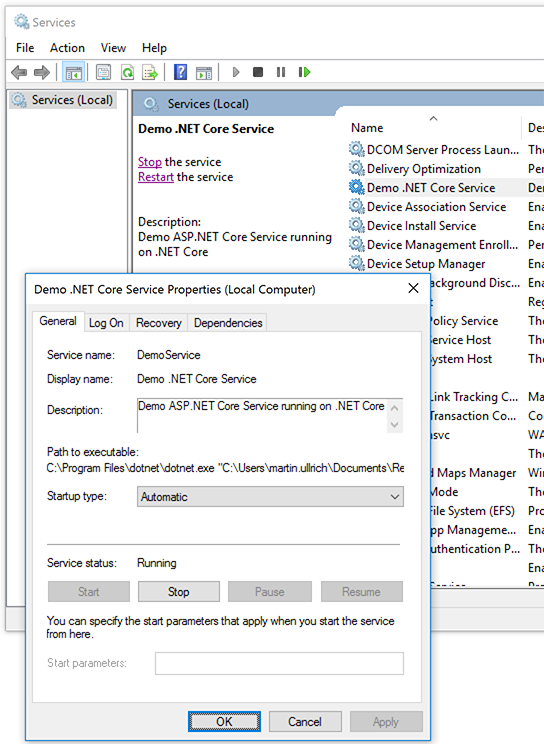
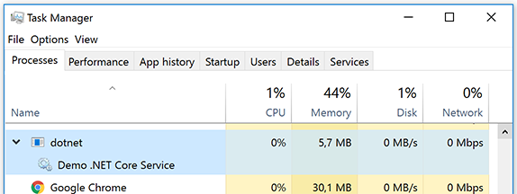

# .NET Standard based Windows Service support for .NET

This repo contains a functional prototype of running a .NET Core application as windows service, without
the need for a wrapper assembly or the full (desktop) .NET Framework.
It is built using P/Invoke calls into native windows assemblies.

Usage szenarios include:
* Running on Windows Nano Server (no full framework but can run windows services)
* Shipping a modern service application using the latest .NET core version to systems
  where you cannot upgrade to new versions of .NET, but you want to use new framework features.
* Build truly protable applications that can for example run as service on windows and as daemon on linux,
  just using runtime checks / switchs

## How to use the example application
Prerequisites:
* .NET Core SDK Preview 2 / 2.1 (`project.json` support)
* Windows machine
* **Elevated command propmt**: Run cmd as administrator.
```cmd
> cd samples\TestService
> dotnet restore
> dotnet run --register-service --urls http://*:5080
...
Sucessfully registered and started service "Demo ASP.NET Core on .NET Core Service"
```
Open `http://localhost:5080` in a browser. You should see `Hello world`.

The "Services" administrative tool should show the service:



```cmd
> dotnet run --unregister-service
...
Sucessfully unregistered service "Demo ASP.NET Core on .NET Core Service"
```
Note that the service may show up as `disabled` for some time until all tools acessing the windows services apis have been closed.
See this [Stackoverflow question](http://stackoverflow.com/questions/20561990/how-to-solve-the-specified-service-has-been-marked-for-deletion-error).

## API

Add a NuGet package reference to `DasMulli.Win32.ServiceUtils`.

Write a windows service using:

```c#
using DasMulli.Win32.ServiceUtils;

class Program
{
    public static void Main(string[] args)
    {
        var myService = new MyService();
        var serviceHost = new Win32ServiceHost(myService);
        serviceHost.Run();
    }
}

class MyService : IWin32Service
{
    public string ServiceName => "Test Service";

    public void Start(string[] startupArguments, ServiceStoppedCallback serviceStoppedCallback)
    {
        // Start coolness and return
    }

    public void Stop()
    {
        // shut it down again
    }
}
```

You can then register your service via sc.exe (run cmd / powershell as administrator!):

`sc.exe create MyService DisplayName= "My Service" binpath= "C:\Program Files\dotnet\dotnet.exe C:\path\to\MyService.dll --run-as-service"`

Now go the services console / task manager and start your service.

Not that `sc` will instal your service as `SYSTEM` user which has way to many access rights to run things like web apps.
See [it's reference](https://technet.microsoft.com/en-us/library/cc990289(v=ws.11).aspx) for more options.

If you want to get rid of it again, use:

`sc.exe delete MyService`

You can also create a service that registers itself like the example provided by
taking a look at [the sample source](./samples/TestService/Program.cs).

## Limitations

The following szenarios are missing:
* Proper handling of errors.
  * Basically, everything will throw a `Win32Exception` if something goes wrong.
  * All service implementation exceptions will report exit code -1 / 0xffffffff to the service control manager.
    Will add exception logging mechanism.
* Setting / updating the description field.
* Support for services supporting pause and continue commands as well as other commands (power event, system shutdown)
  * Partially addressed. Consumers can now use `IWin32ServiceStateMachine` to implement custom behavior.